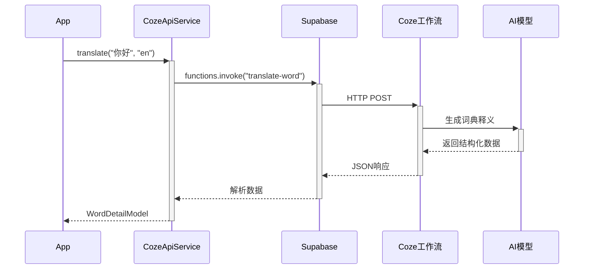

# 扣子AI词典集成指南

## 概述
本文档说明如何在ToneUp App中使用扣子(Coze)工作流实现高质量AI词典翻译,替代原有的百度API方案。

## 架构变更

### 旧架构 (百度API)
```
L1: LRU内存缓存
L2: SQLite本地缓存  
L3: Supabase云端数据库
L4: 百度词典版API (仅支持中英互查,其他语种不支持)
L5: 拼音降级兜底
```

**问题:**
- 百度API仅支持中英互查,日语/韩语无法使用
- 翻译质量不稳定,专业词汇准确度低
- QPS限制严格,需频繁重试

### 新架构 (扣子AI工作流)
```
L1: LRU内存缓存 (200词上限,~100KB)
L2: SQLite本地缓存 (移动端持久化,Web端IndexedDB)
L3: Supabase云端数据库 (跨设备同步)
L4: 扣子AI词典工作流 (多语种支持,高质量翻译) ⭐新
L5: 拼音降级兜底
```

**优势:**
- ✅ 支持多语种 (中英、中日、中韩等)
- ✅ AI生成释义更准确、自然
- ✅ 可包含例句、词性、HSK等级等丰富信息
- ✅ 与现有练习生成/材料生成流程统一 (都用扣子工作流)

## 实现细节

### 1. 服务层封装 (`CozeApiService`)

位置: [`lib/services/coze_api_service.dart`](../lib/services/coze_api_service.dart)

**核心方法:**

```dart
/// 翻译单个词语
Future<WordDetailModel?> translate({
  required String word,
  required String targetLanguage,
  String? context, // 上下文信息(可选)
})

/// 批量翻译(限流版本)
Future<Map<String, WordDetailModel?>> translateBatch(
  List<String> words, {
  required String targetLanguage,
  String? context,
})

/// 检查服务可用性
Future<bool> isAvailable()
```

**调用流程:**



### 2. 集成到词典服务 (`SimpleDictionaryService`)

位置: [`lib/services/simple_dictionary_service.dart`](../lib/services/simple_dictionary_service.dart)

**查询流程:**

```dart
Future<WordDetailModel> getWordDetail({
  required String word,
  required String language,
  String? contextTranslation,
}) async {
  // L1: 内存缓存检查
  if (cachedInMemory != null) return cachedInMemory;
  
  // L2: SQLite缓存检查
  if (cachedWord != null) return cachedWord;
  
  // L3: Supabase云端查询
  if (supabaseWord != null) return supabaseWord;
  
  // L4: 扣子AI工作流 ⭐新逻辑
  if (await _cozeApi.isAvailable()) {
    final apiWord = await _cozeApi.translate(
      word: word,
      targetLanguage: language,
      context: contextTranslation,
    );
    if (apiWord != null) {
      // 保存到L3/L2缓存
      await _saveToSupabase(apiWord, language);
      await _sqliteCache.saveWord(apiWord, language);
      return apiWord;
    }
  }
  
  // L5: 拼音降级兜底
  return fallbackWord;
}
```

## Supabase Edge Function 部署

### 创建 Edge Function

在 `supabase/functions/translate-word/index.ts` 创建函数:

```typescript
import { serve } from "https://deno.land/std@0.168.0/http/server.ts";
import { corsHeaders } from "../_shared/cors.ts";

interface TranslateRequest {
  word: string;
  target_language: string;
  context?: string;
}

interface CozeResponse {
  pinyin: string;
  summary: string;
  hsk_level?: number;
  entries: Array<{
    pos: string; // 词性 (n., v., adj.等)
    definitions: string[];
    examples: string[];
  }>;
}

serve(async (req) => {
  // CORS预检
  if (req.method === 'OPTIONS') {
    return new Response('ok', { headers: corsHeaders });
  }

  try {
    const { word, target_language, context } = await req.json() as TranslateRequest;

    // 调用扣子工作流API
    const cozeApiKey = Deno.env.get('COZE_API_KEY');
    const cozeWorkflowId = Deno.env.get('COZE_WORKFLOW_ID_DICTIONARY'); // 词典工作流ID

    const response = await fetch('https://api.coze.cn/v1/workflow/run', {
      method: 'POST',
      headers: {
        'Authorization': `Bearer ${cozeApiKey}`,
        'Content-Type': 'application/json',
      },
      body: JSON.stringify({
        workflow_id: cozeWorkflowId,
        parameters: {
          word: word,
          target_language: target_language,
          context: context || '',
        },
      }),
    });

    if (!response.ok) {
      throw new Error(`Coze API error: ${response.status}`);
    }

    const data = await response.json();
    
    // 解析扣子工作流返回的数据(需根据实际工作流输出调整)
    const result: CozeResponse = {
      pinyin: data.data?.pinyin || '',
      summary: data.data?.summary || '',
      hsk_level: data.data?.hsk_level,
      entries: data.data?.entries || [],
    };

    return new Response(JSON.stringify(result), {
      headers: { ...corsHeaders, 'Content-Type': 'application/json' },
    });
  } catch (error) {
    return new Response(JSON.stringify({ error: error.message }), {
      status: 500,
      headers: { ...corsHeaders, 'Content-Type': 'application/json' },
    });
  }
});
```

### 部署命令

```bash
# 部署Edge Function
supabase functions deploy translate-word

# 设置环境变量
supabase secrets set COZE_API_KEY=your_coze_api_key
supabase secrets set COZE_WORKFLOW_ID_DICTIONARY=your_workflow_id
```

### 本地测试

```bash
# 启动本地Supabase
supabase start

# 运行Edge Function
supabase functions serve translate-word --env-file .env.local

# 测试请求
curl -i --location --request POST 'http://localhost:54321/functions/v1/translate-word' \
  --header 'Authorization: Bearer YOUR_ANON_KEY' \
  --header 'Content-Type: application/json' \
  --data '{"word":"你好","target_language":"en"}'
```

## 扣子工作流配置

### 工作流输入参数

| 参数名 | 类型 | 说明 | 示例 |
|--------|------|------|------|
| `word` | string | 待翻译的汉字词语 | "你好" |
| `target_language` | string | 目标语言代码 | "en" / "ja" / "ko" |
| `context` | string | 上下文信息(可选) | "打招呼场景" |

### 工作流输出格式

**必需字段:**

```json
{
  "pinyin": "nǐ hǎo",
  "summary": "hello; hi",
  "hsk_level": 1,
  "entries": [
    {
      "pos": "interjection",
      "definitions": [
        "hello",
        "hi",
        "how do you do"
      ],
      "examples": [
        "你好,很高兴认识你。 - Hello, nice to meet you.",
        "你好吗? - How are you?"
      ]
    }
  ]
}
```

**字段说明:**

- `pinyin`: 拼音(带声调符号),如无可留空(App端会自动生成)
- `summary`: 简短释义(用于卡片显示)
- `hsk_level`: HSK等级 (1-6),可选
- `entries`: 详细词条数组
  - `pos`: 词性 (n. / v. / adj. / intj. 等)
  - `definitions`: 释义列表
  - `examples`: 例句列表 (格式: "中文 - English")

### 推荐的AI Prompt模板

```
你是一个专业的汉英词典编纂助手。用户会给你一个中文词语,你需要生成专业的词典条目。

输入:
- word: {word}
- target_language: {target_language}
- context: {context}

请按以下JSON格式输出:
{
  "pinyin": "汉语拼音(带声调)",
  "summary": "简短翻译(1-3个词)",
  "hsk_level": HSK等级(1-6),
  "entries": [
    {
      "pos": "词性",
      "definitions": ["释义1", "释义2"],
      "examples": ["例句1 - 翻译1", "例句2 - 翻译2"]
    }
  ]
}

要求:
1. 释义要准确、自然,符合目标语言习惯
2. 例句要实用、常见,涵盖不同用法
3. 词性标注要规范 (n./v./adj./adv./prep./conj./intj.等)
4. HSK等级要准确(参考官方HSK词表)
```

## 成本控制建议

### 1. 缓存策略优化

- **L1缓存(内存)**: 200词上限,命中率~60%
- **L2缓存(SQLite)**: 无限制,命中率~30%
- **L3缓存(Supabase)**: 跨设备同步,命中率~5%

**预期效果**: 95%的查询无需调用扣子API

### 2. 预加载常用词

```dart
// 在App启动时预加载HSK1-3高频词(约1200词)
final commonWords = ['你好', '谢谢', '再见', ...];
await _cozeApi.translateBatch(
  commonWords,
  targetLanguage: 'en',
);
```

### 3. 批量调用限流

```dart
// CozeApiService内置限流: 每次调用间隔200ms
// 避免触发扣子工作流频率限制
await Future.delayed(const Duration(milliseconds: 200));
```

### 4. 监控调用量

在Supabase Dashboard查看Edge Function调用统计:
- 每日调用次数
- 平均响应时间
- 错误率

## 测试指南

### Flutter端测试

```dart
// 测试扣子AI词典服务
final service = SimpleDictionaryService();
final result = await service.testApiDictionary(
  testWord: '学习',
  language: 'en',
);

print('测试结果: ${result['success']}');
print('翻译: ${result['summary']}');
print('耗时: ${result['query_time_ms']}ms');
```

### 单元测试

```dart
// test/services/coze_api_service_test.dart
test('应该成功翻译中文词语到英语', () async {
  final service = CozeApiService();
  final result = await service.translate(
    word: '你好',
    targetLanguage: 'en',
  );
  
  expect(result, isNotNull);
  expect(result!.word, equals('你好'));
  expect(result.pinyin, contains('nǐ'));
  expect(result.summary, isNotEmpty);
});
```

## 迁移检查清单

- [x] 创建 `CozeApiService` 服务
- [x] 集成到 `SimpleDictionaryService` L4层
- [x] 更新代码注释和文档
- [ ] 在扣子平台创建词典翻译工作流
- [ ] 部署 `translate-word` Edge Function
- [ ] 配置环境变量 (COZE_API_KEY, COZE_WORKFLOW_ID_DICTIONARY)
- [ ] 本地测试验证工作流输出格式
- [ ] 生产环境小规模测试 (100次调用)
- [ ] 监控调用量和成本
- [ ] 预加载常用词到缓存
- [ ] (可选) 移除百度API相关代码

## 常见问题

### Q: 扣子工作流返回格式不匹配怎么办?

A: 修改 `CozeApiService._parseCozeResponse()` 方法,适配实际的工作流输出格式。建议先用Postman测试工作流API,确认返回结构。

### Q: 如何降低调用成本?

A: 
1. 提高缓存命中率(预加载常用词)
2. 批量调用时合理限流
3. 监控调用量,设置告警阈值

### Q: 旧的百度API代码需要删除吗?

A: 暂时保留 `BaiduDictService` 作为备用方案。待扣子方案稳定运行1个月后再移除。

### Q: 如何支持离线翻译?

A: L1-L3缓存已支持离线访问。对于新词,需要网络连接调用扣子API。可考虑预加载HSK1-6全部词汇(~5000词)。

## 相关文档

- [项目总览](./PROJECT_OVERVIEW.md)
- [数据模型](./DATA_MODELS.md)
- [词典快速入门](./DICTIONARY_QUICKSTART.md)
- [扣子工作流文档](https://www.coze.cn/docs/guides/workflow)
